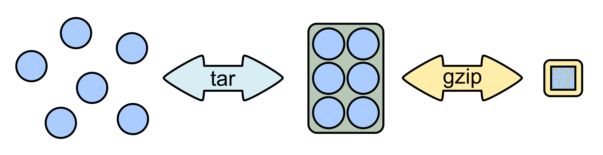

<<<<<<< HEAD
# Common data formats
These notes cover some of the common data formats encountered in most data science environments.

## 1. Measurement
A large part of data science (and quantitative research in general) is measurement. Measurement is how "insights" or "policies" are constructed, because one cannot construct a policy without first measuring what the policy is meant to accomplish. 

For example, suppose that a basketball coach is trying to find the lineup that will give her the best chance of winning. How would she quantify "best lineup"? It could be measured by comparing points scored vs. points allowed while each possible lineup is on the court. This simple measurement is one way to quantify "best lineup." Of course, the coach will likely also be interested in *why* the "best lineup" is performing as well as it is. In this case, she would need additional measurements to paint a clearer picture of what is happening among those particular teammates. Perhaps that lineup plays better defense, or passes the ball more frequently, or gets more rebounds, or ...

Our class will not focus much on the "meta" question of how a particular qualitative phenomenon is measured with data, but the importance of measurement (and a solid understanding of what the data set is and is not capturing) should always be in the back of a data scientist's mind.


Here are the topics we'll discuss today:

* Statistical programming languages
* Visualization tools (usually included with the above)
* Big Data management software
* Data collection tools

## 1. Statistical Programming Languages
The three main mathematical and statistical programming languages we will use and discuss in this class are R, Python, and Julia. There are many other languages that can be used for statistical analysis: Stata, SAS, SPSS, Matlab, and even JavaScript. Many of the languages listed in the prior sentence were built on C, C++, or Fortran. The latter three are known as **compiled** languages, while all other are known as **scripted** languages. Compiled languages require the user to write code that the CPU can understand, whereas scripted languages allow the user to write code that is more human-readable, at the expense of performance. 

Julia is the newest language and attempts to be a scripted language that can run at compiled speeds. R, Python, and others also have facilities that allow a user to insert C, C++, or Fortran code into the script and achieve greater performance. Such instances are often referred to as ``glue code'' as they require interfacing between different languages in the same code script.

Below is a table summarizing the main differences between R, Python, and Julia:


|                                    | R         | Python   | Julia    |
|------------------------------------|-----------|----------|----------|
| Date established                   | 1995      | 1991     | 2012     |
| Approximate user base              | large     | largest  | smallest |
| Used for data science              | <ul><li>[x]</li></ul> | <ul><li>[x]</li></ul>  | <ul><li>[x]</li></ul> |
| Used for general-purpose computing | <ul><li>[ ]</li></ul> | <ul><li>[x]</li></ul>  | <ul><li>[x]</li></ul> |
| Open source                        | <ul><li>[x]</li></ul> | <ul><li>[x]</li></ul>  | <ul><li>[x]</li></ul> |
| Web scraping package?              | `rvest`   | `BeautifulSoup` | `Gumbo.jl`, `Cascadia.jl` |
| Visualization library?             | `ggplot2` | `matplotlib` | `Plots.jl`|
| Machine learning library?          | [sporadic](https://cran.r-project.org/web/views/MachineLearning.html) | scikit-learn | `Flux.jl`|
| Biggest advantage                  | `tidyverse` | ubiquity | speed    |
| Biggest disadvantage               | speed     | speed    | age      |

Which programming language should you learn? It depends on what you already know and what you want to do after graduation. If you are already well acquainted with R's tidyverse, I would recommend using this course to learn Python or Julia. If you don't have a good handle on R, I would recommend using this course to learn the R tidyverse, as it is a very popular set of DS tools.

## 2. Web Scraping
With the proliferation of the internet, data is being collected all the time and stored in publicly accessible places (we call these webpages). Thus, one of the tools in a data scientist's toolbox should be the ability to leverage this information to better inform the objective at hand (prediction, ``insights'', ``policy'' or what have you). 

### 2.1 How does web scraping work?
Typically *web scraping* involves one of two tasks:

1. Using an application program interface (API) to download data
2. Downloading HTML files and parsing their text to extract data

#### APIs
APIs are employed by many of the most notable web companies (twitter, Facebook, LinkedIn, yelp, etc.). These companies employ APIs so that they can guard their data---either for privacy concerns, or for monetary reasons. So, for example, although Donald Trump's tweets are public record, twitter limits the number of tweets that you can extract from his timeline (3,200 is the current limit). Why do they impose this limit? I'm not sure. 

As another example, LinkedIn limits the information that one can scrape from its website by forcing users to go to through its API (which has precious little information relative to what is in a full LinkedIn profile).

#### Parsing
With all of this talk about gated APIs, you might be thinking, "Why can't I just download the HTML code from the website and parse the data myself?" This can be a useful option in many cases, and it is the only option for websites that don't have an API. One drawback to this approach is that some websites (like LinkedIn or yelp) monitor the IP addresses of all website viewers. If you ping their website too frequently within a given period of time, they may block your access to their website.

### 2.2 Web scraping in the three data science languages
Web scraping can be done in almost any programming language out there. However, there are convenient resources in R, Python, and Julia, which have packages built to parse HTML blocks and automatically load the data into a tabular environment for immediate analysis. We'll talk more about this process in a few weeks. 

## 3. Handling large data sets
In some cases, you might encounter data sets that are too big to fit on a single hard drive (or are too big to fit in R/Julia/Python's memory). For example, consider data held by Amazon on screen clicks, cart inventory, and purchases of all of its 310 million active users. Most desktop computers these days don't come with more than 64GB of RAM, and most laptops don't come with more than 32GB. If you try to load into R a data set that is larger than your machine's RAM capacity, your machine will freeze and you'll have to unplug it if you want to use it again. [This has happened to me a few times in the past with Matlab, so I speak from experience.]

What do you do when you can't open all of your data? Depending on how the data is stored, you may be able to split the files up into manageable chunks (e.g. split the huge file into 100 pieces, where each piece can fit into R). But that's not a viable longterm solution if your data set gets updated, or if you want to compute summary statistics on the full set of data, or if you want to do other operations on it, like create a new variable.

### 3.1 RDDs
The solution to this problem is Resilient Distributed Datasets (RDDs). To use RDDs you need a cluster of computers and software such as Hadoop or Spark. Spark chops your huge data set into manageable chunks and executes actions on those chunks in parallel. One can do many common data operations like subsetting the data, creating summary statistics, etc. The crucial aspect of RDDs is that they are built to withstand any disruption in the computing cluster. So if one of the machines on the cluster happens to fail, the data it was holding can be seamlessly transferred to another machine.

### 3.2 SQL
While not necessarily required for handling mega data sets, SQL is the most common database language to transform data into a more usable form for statistical software to use. With SQL, one can easily subset, merge, and perform other common data transformations.

You will get experience using both SQL and Spark a bit later in the class.
 
## 4. Visualization
Visualization is an important tool for data scientists. Visualization allows humans to see in multiple dimensions what the data looks like, spot outliers, and otherwise perform "sanity checks" on the data. I'll review here the primary visualization tools in the three DS programming languages.

### 4.1 `ggplot2` (R)
`ggplot2` is the visualization package included in the R `tidyverse`. This package has a large user following and the graphic style is immediately recognizable. I personally don't care for the design aesthetic, but it can be hard to argue with ubiquity. If you're interested in learning this, I recommend checking out the [data visualization](http://r4ds.had.co.nz/data-visualisation.html) and [graphics for communication](http://r4ds.had.co.nz/graphics-for-communication.html) chapters in the [R for data science](http://r4ds.had.co.nz/) online textbook.

### 4.2 `matplotlib` (Python)
`matplotlib` is the original graphics package for Python. It was designed to mimic Matlab's visualization syntax. Beyond `matplotlib`, there is a `ggplot` package which ports to `ggplot2`, as well as a variety of others.

### 4.3 `Plots.jl` (Julia)
`Plots.jl` is a package that came about in the past year. Its innovation is that, once the user provides it with code, it can output graphics using any other package as a backend. For example, a user can write some code to create a data visualization which creates a graphic using `ggplot2`. Then, by only tweaking one option in that code, the user could output the same graphic in `matplotlib`. This package is a nice way to only have to code once but be able to create graphics in many different styles.

## 5. Modeling
Now that you've collected your data, cleaned it up, and visualized it, you're ready to start doing some statistical modeling. The main objectives of statistical modeling are as follows:

1. Use the data to test theories. For example, Amazon may wonder "Are women more likely than men to subscribe to Prime?" Without data this is simply a "hunch" or a belief. 
2. Use the data to predict behavior. For example, many companies need to optimize their inventory management so that the right amount of inventory is in the right stores at the right time. 
3. use the data to explain behavior. This is a bit more difficult, because it goes beyond prediction. Once a company or government knows the "why" behind consumer/citizen behavior, it can optimize its behavior in response. (Note here that the "why" implies a causal relationship---this requires having a particular type of data or requires making additional assumptions and making use of additional statistical methods than are used for prediction.)

## References
* [Common data science file formats](https://www.analyticsvidhya.com/blog/2017/03/read-commonly-used-formats-using-python/)
* [Measurement YouTube video](https://www.youtube.com/watch?v=4RZiWZXdbTw)
=======
# Data overview
Today's discussion will focus on grappling with data.

## 1. A note on file extensions
Often, if you download a file, you will immediately understand what type of a file it is by its extension. File extensions in and of themselves don't serve any particular purpose other than convenience.

File extensions were created so that humans could keep track of which files on their workspace are scripts, which are binaries, etc.

### 1.1 Why is the file format important?
File formats matter because they may need to match the environment you're working in. If you use the wrong file format, it may cause your computations to run slower than otherwise. To the extent that the environment you're working in requires a specific file format, then using the correct format is essential.

## 2. Common file extensions you'll see when working with data
In the following table, I list some of the most common file extensions. For a more complete list of almost every file extension imaginable (note: they missed Stata's `.do` and `.dta` formats), see [here](https://en.wikipedia.org/wiki/List_of_file_formats).

Another great discussion about file formats is [here](https://opendata.stackexchange.com/questions/1208/a-python-guide-for-open-data-file-formats) on stackexchange.

### 2.1 Open-format file extensions

The following file extensions are not tied to a specific software program. In this sense they are "raw" and can be viewed in any sort of text editor.

| File extension                     | Description |
|------------------------------------|-------------|
| CSV                                | Comma separated values; data is in tabular form with column breaks marked by commas |
| TSV                                | Tab separated values; data is in tabular form with column breaks marked by tabs |
| DAT                                | Tab-delimited tabular data (ASCII file) |
| TXT                                | Plain text; not organized in any specific manner (though usually columns are delimited with tabs or commsa) |
| XML                                | eXtensible Markup Language; data is in text form with tags marking different fields |
| HTML                               | HyperText Markup Language; similar to XML; used for almost every webpage you view |
| [YAML](https://en.wikipedia.org/wiki/YAML) | YAML Ain't Markup Language; human readable version of XML |
| JSON                               | JavaScript Object Notation; similar to YAML in that it has a human readable element. YAML is technically a superset of JSON. |
| HDF                                | Hierarchical Data Format; bills itself as a "scientific data format" that can handle all types of data (tabular, text, images, etc.) |
| PDF                                | Portable Document Format; not a great way to store data, but there exists much data in PDF format. Good luck unpacking it! |
| TIFF, JPEG                         | These common image formats are used to store data in the form of images, or sometimes pictures of text data. There exist image processing libraries in almost every scientific programming language that can convert data in this format into more usable formats. |
| MP3, WAV                           | These common audio formats may be used to store data. For example, voice-to-text applications have some way of converting income audio (in some format) into data that the machine can comprehend. The same holds for MP4 and other video file formats (e.g. for video input to self-driving cars, etc.) |

#### 2.1.1 Examples of CSV, TSV, XML, YAML, and JSON files:

**A possible JSON representation describing a person** ([source](https://en.wikipedia.org/wiki/JSON#Example))
```JSON
{
  "firstName": "John",
  "lastName": "Smith",
  "isAlive": true,
  "age": 27,
  "address": {
    "streetAddress": "21 2nd Street",
    "city": "New York",
    "state": "NY",
    "postalCode": "10021-3100"
  },
  "phoneNumbers": [
    {
      "type": "home",
      "number": "212 555-1234"
    },
    {
      "type": "office",
      "number": "646 555-4567"
    },
    {
      "type": "mobile",
      "number": "123 456-7890"
    }
  ],
  "children": [],
  "spouse": null
}
```

**The same example as above, but in XML:** ([source](https://en.wikipedia.org/wiki/JSON#Example))
```XML
<person>
  <firstName>John</firstName>
  <lastName>Smith</lastName>
  <age>25</age>
  <address>
    <streetAddress>21 2nd Street</streetAddress>
    <city>New York</city>
    <state>NY</state>
    <postalCode>10021</postalCode>
  </address>
  <phoneNumber>
    <type>home</type>
    <number>212 555-1234</number>
  </phoneNumber>
  <phoneNumber>
    <type>fax</type>
    <number>646 555-4567</number>
  </phoneNumber>
  <gender>
    <type>male</type>
  </gender>
</person>
```

**The same example, but in YAML:** ([source](https://en.wikipedia.org/wiki/JSON#Example))
```YAML
firstName: John
lastName: Smith
age: 25
address: 
  streetAddress: 21 2nd Street
  city: New York
  state: NY
  postalCode: '10021'
phoneNumber: 
- type: home
  number: 212 555-1234
- type: fax
  number: 646 555-4567
gender: 
  type: male
```
Note that the JSON code above is also valid YAML; YAML simply has an alternative syntax that makes it more human-readable.

### 2.2. Proprietary file extensions

The following file extensions typically require additional software to read, edit, or convert to another format.

| File extension                     | Description |
|------------------------------------|-------------|
| DB                                 | A common file extension for tabular data for SQLite |
| SQLITE                             | Another common file extension for tabular data for SQLite |
| XLS, XLSX                          | Tab-delimited tabular data for Microsoft Excel |
| RDA, RDATA                         | Tabular file format for R |
| MAT                                | ... for Matlab |
| SAS7BDAT                           | ... for SAS |
| SAV                                | ... for SPSS |
| DTA                                | ... for Stata |

## 3. Archiving & file compression
Because data can be big and bulky, it is often easier to store and share the data in compressed form.

| File extension                     | Description |
|------------------------------------|-------------|
| ZIP                                | The most common format for file compression |
| Z                                  | Alternative to ZIP; uses a slightly different format for compression |
| 7Z                                 | Alternative to ZIP; uses [7-Zip](http://www.7-zip.org/) software for compression |
| GZ                                 | Another alternative to ZIP (primarily used in Linux systems), using what's called `gzip` |
| TAR                                | So-called "tarball" which is a way to collect many files into one archive file. TAR stands for "Tape ARchive" |
| TAR.GZ; TGZ                        | A compressed version of a tarball (compression via `gzip`) |
| TAR.BZ2; .TB2; .TBZ; .TBZ2         | Compressed tarball (via `bzip2`) |


Image source: By Th0msn80 - Own work, CC BY 3.0, https://commons.wikimedia.org/w/index.php?curid=4316146

## 4. Other file types that aren't data
There are many file types that don't correspond to readable data. For example, script files (e.g. `.R`, `.py`, `.jl`, `.sql`, `.do`, `.cpp`, `.f90`, ...) are text files with convenient extensions to help the user remember which programming language the code is in.

As a rule of thumb, if you don't recognize the extension of a file, it's best to inspect the file in a text editor (though pay attention to the size of the file as this can also help you discern whether it's code or data)

# General Types of Data
When you think of data, you probably think of rows and columns, like a matrix or a spreadsheet. But it turns out there are other ways to store data, and you should know their similarities and differences to tabular data.

## 5. Dictionaries (a.k.a. Hash tables)
A dictionary is a list that contains `keys` and `values`. Each key points to one value. While this may seem like an odd way to store data, it turns out that there are many, many applications in which this is the most efficient way to store things.

We won't get into the nitty gritty details of dictionaries, but they are the workhorse of computer science, and you should at least know what they are and how they differ from tabular data. In fact, dictionaries are often used to store multiple arrays in one file (e.g. in Matlab and other languages where the system can store multiple arrays at once).

The capability to manipulate hash tables is included in almost every major scientific programming language (although it is quite clunky in R ... this is why R is not considered to be a "general purpose programming language" by some people).


Image source: By Jorge Stolfi - Own work, CC BY-SA 3.0, https://commons.wikimedia.org/w/index.php?curid=6471238 

The Julia code for constructing the dictionary above is
```Julia
mydictionary = Dict("John Smith"=>"521-1234", "Lisa Smith"=>"521-8976", "Sandra Dee"=>"521-9655")
```

## 6. Big Data file types
Big Data file systems like Hadoop and Spark often use the same file types as R, SQL, Python, and Julia. That is, `CSV` and `TSV` files are the workhorse. Because of the nature of distributed file systems (which we will discuss in much greater detail next time), it is often the case that JSON and XML are not good choices because they can't be broken up across machines. (Note: there is a distinction between JSON files and JSON records; see the second link at the bottom of this document for further details.)

### 6.1 Sequence
Sequence files are dictionaries that have been optimized for Hadoop and friends. The advantage to taking the dictionary approach is that the files can easily be coupled and decoupled.

### 6.2 Avro
Avro is an evolved version of Sequence---it contains more capability to store complex objects natively

### 6.3 Parquet
Parquet is a format that allows Hadoop and friends to partition the data column-wise (rather than row-wise).

Other formats in this vein are RC (Record Columnar) and ORC (Optimized Record Columnar).

# Useful Links

* [A beginner's guide to Hadoop storage formats](https://blog.matthewrathbone.com/2016/09/01/a-beginners-guide-to-hadoop-storage-formats.html)
* [Hadoop File Formats: It's not just CSV anymore](https://community.hds.com/community/products-and-solutions/pentaho/blog/2017/11/07/hadoop-file-formats-its-not-just-csv-anymore)
>>>>>>> upstream/master
